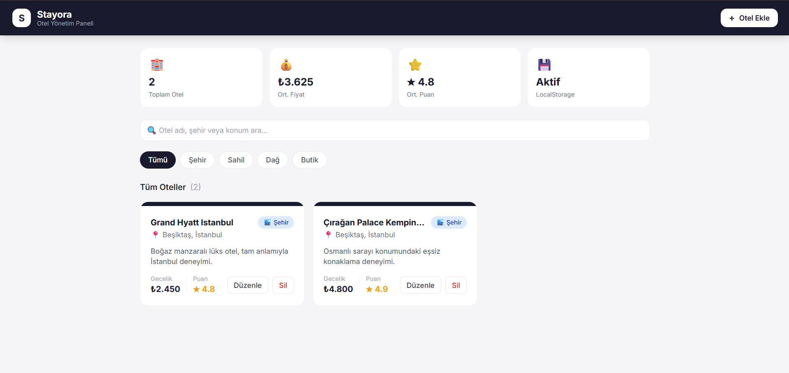
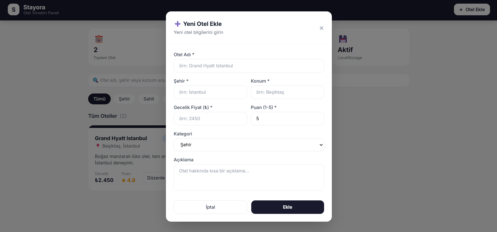

# Stayora — Otel Yönetim Paneli

Stayora, React + Vite + Tailwind CSS kullanılarak geliştirilmiş bir otel yönetim uygulamasıdır. Veriler LocalStorage'da saklanır.

## Ekran Görüntüleri

### Ana Sayfa — Otel Listesi


### Yeni Otel Ekle


## Özellikler

- ➕ **Ekle** — Yeni otel ekleme (Create)
- 📋 **Listele** — Tüm otelleri listeleme ve filtreleme (Read)
- ✏️ **Güncelle** — Mevcut otel bilgilerini düzenleme (Update)
- 🗑️ **Sil** — Otel kaydını silme (Delete)
- 🔍 Arama ve kategori filtreleme
- 💾 LocalStorage ile kalıcı veri saklama

## Teknolojiler

- **React** (Vite)
- **Tailwind CSS**
- **LocalStorage**

## Kurulum

```bash
npm install
npm run dev
```

## Klasör Yapısı

```
src/
├── components/    # Yeniden kullanılabilir bileşenler
│   ├── Navbar.jsx
│   ├── HotelCard.jsx
│   ├── HotelForm.jsx
│   └── StatsBar.jsx
├── pages/         # Sayfa bileşenleri
│   └── HomePage.jsx
├── interfaces/    # Veri modelleri
│   └── Hotel.js
├── hooks/         # Custom hooks
│   └── useHotels.js
├── App.jsx
└── main.jsx
```
